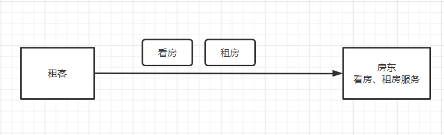
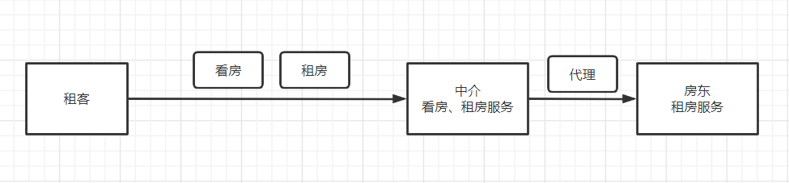
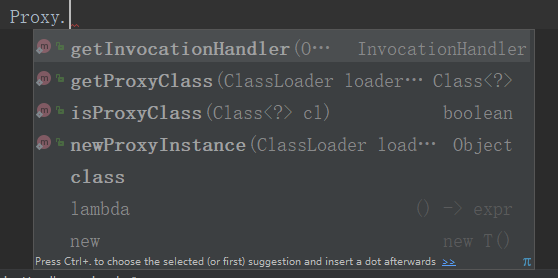

# Java代理模式

## 前言

**采用【租客 - 中介 - 房东】的案例介绍**

最初租客想要租房，租客会直接联系到房东，房东带着看房、签合同等一系列操作。由房东提供看房、租房的服务。



```java
// 房东
public class Master {
    public void see(){
        System.out.println("房东带看房");
    }

    public void rent(){
        System.out.println("房东出租房屋");
    }
}
```
```java
// 租客
public class MyClient {
    public static void main(String[] args) {
        Master master = new Master();
        master.see();
        master.rent();
    }
}
```

## 静态代理

房东觉得这些事情太繁琐了，他仅仅就是想做租房这件事件，其他的事情懒得做，于是就有了中介，中介带领租客看房和租客签合同，房东只需要提供租房服务，中介提供看房、租房服务，这里中介就是一种代理模式，中介提供的租房服务就是对房东提供的租房服务的代理，租客虽然是通过中介提供的租房服务，但实际上租到的是房东提供的房子



中介要代理房东的租房服务，就要先把房东的租房服务抽象成接口

```java
// 租房服务接口
public interface Rent {
    public void rent();
}
```
房东通过实现租房接口提供租房服务
```java
// 房东
public class Master implements Rent {
    @Override
    public void rent() {
        System.out.println("房东出租房屋");
    }
}
```
中介也通过实现租房接口提供租房服务，因为中介提供的租房服务实际上是代理的房东的租房服务，中介并没有房子可以出租，所以在提供租房服务之前要先注入房东的实例，即和房东达成协议。中介的租房服务最终调用的还是房东提供的服务。自此基础上中介可以提供自己的其他服务，如带租客看房
```java
// 中介
public class MaterProxy implements Rent {

    private MasterImpl master;

    // 先注入房东实列
    // 也可通过构造函数注入
    public void setMaster(MasterImpl master) {
        this.master = master;
    }

    @Override
    public void rent() {
        master.rent(); // 代理房东的看房服务，中介的租房服务最终调用的是房东提供的服务
    }

    // 中介提供看房服务
    private void see() {
        System.out.println("中介带领看房");
    }

}
```

此时，租客就不用直接接触房东而通过中介的看房、租房服务租到房子

```java
public class MyClient {
    public static void main(String[] args) {
        Master master = new Master(); // 房东的实例不能少

        MaterProxy proxy = new MaterProxy();
        proxy.setMaster(master); // 注入房东实例
        // 调用中介提供的服务
		proxy.see();
        proxy.rent();
    }
}
```

**静态代理优点**

* 可以使业务类关注的逻辑更加纯粹，不用关注公共逻辑（如日志功能）
* 当公共业务发生拓展时，便于集中维护

## 动态代理

静态代理的工作量过于繁琐，每有一个需要代理的类，就需要有一个对应的代理类，会带来双倍的编码量从而降低效率，动态代理可以很好的解决这一问题

上述租房服务接口和房东的代码不变，房东仍通过实现租房接口来提供租房服务

中介的动态代理需要借助java的反射机制实现，主要用到反射包下的两个类：

### Proxy

官方解释为：

```java
/**
 * {@code Proxy} provides static methods for creating dynamic proxy
 * classes and instances, and it is also the superclass of all
 * dynamic proxy classes created by those methods.
 */
```

Proxy提供了创建动态代理实例的静态方法，同时也是这些方法创建出来的实例的父类

Proxy提供的静态方法有



我们这里使用`public static Object newProxyInstance(ClassLoader loader,Class<?>[] interfaces,InvocationHandler h)`

通过上述方法获取到动态代理实例，我们就可以通过这个动态代理实例执行代理提供的服务。

### InvocationHandler

官方解释为：

```java
/**
 * {@code InvocationHandler} is the interface implemented by
 * the <i>invocation handler</i> of a proxy instance.
 *
 * <p>Each proxy instance has an associated invocation handler.
 * When a method is invoked on a proxy instance, the method
 * invocation is encoded and dispatched to the {@code invoke}
 * method of its invocation handler.
 */
```

InvocationHandler是一个接口，每一个Proxy代理实例都要实现这个接口并重写invoke方法，通过Proxy代理实例执行的方法最终都会通过调用这个实例关联定的InvocationHandler的invoke方法执行。

```java
// 中介
public class ProxyInvocationHandler implements InvocationHandler {

    private Rent rent;

	// 通过构造函数注入租房服务接口
    public ProxyInvocationHandler(Rent rent) {
        this.rent = rent;
    }

    // 通过Proxy提供的静态方法获取到动态代理实例
    public Rent getProxy() {
        return (Rent)Proxy.newProxyInstance(
                this.getClass().getClassLoader(), // 类加载器
                rent.getClass().getInterfaces(), // 接口类
                this); // InvocationHandler
    }

    // 最终调用会执行的invoke方法
    @Override
    public Object invoke(Object proxy, Method method, Object[] args) throws Throwable {
        return method.invoke(target, args);
    }
}
```

```java
// 租客
public class MyClient {
    public static void main(String[] args) {
        Master master = new Master();

        ProxyInvocationHandle proxyInvocationHandler = new ProxyInvocationHandler(master);
        proxyInvocationHandler.getProxy().rent();
    }
}
```

### 封装通用

现在代理类仍然是只能用于租房这一种需求，我们现在将代理类封装成通用类

```java
public class ProxyInvocationHandler<T> implements InvocationHandler {

    private T target;

    public ProxyInvocationHandler(T target) {
        this.target = target;
    }

    public T getProxy() {
        return (T)Proxy.newProxyInstance(
                this.getClass().getClassLoader(),
                target.getClass().getInterfaces(),
                this);
    }

    @Override
    public Object invoke(Object proxy, Method method, Object[] args) throws Throwable {
        // 添加代理自己的服务
        return method.invoke(target, args);
    }
}
```

现在我们调用方式

```java
public class MyClient {
    public static void main(String[] args) {
        Master master = new Master();

        ProxyInvocationHandler<Rent> proxyInvocationHandler = new ProxyInvocationHandler<>(master);
        proxyInvocationHandler.getProxy().rent();
    }
}
```

**动态代理类的优点**

* 一个动态代理类可以代理一类业务
